# RoundTable AI

> Talk together. Decide together. Get it done.

RoundTable AI is a mobile decision room where an AI serves the whole group. Friends bring different budgets, food preferences and time constraints. A shared **Smart Stage** turns those needs into comparable options, a room vote, explicit approval and a traceable outcome.

**[Try the interactive preview](https://shhhivam12.github.io/roundtable-ai-hackathon/evaluator/)** · **[Download the Android APK](https://github.com/shhhivam12/roundtable-ai-hackathon/releases/download/hackathon-2026/roundtable-ai-android-arm64.apk)** · **[Project presentation](https://shhhivam12.github.io/roundtable-ai-hackathon/evaluator/roundtable-ai-project-presentation.pdf)**

**[Watch the 3-minute YouTube demo](https://youtu.be/Ysq3IAfMn4Q)** — portrait conversation, actual app walkthrough, Agora architecture and captions.

[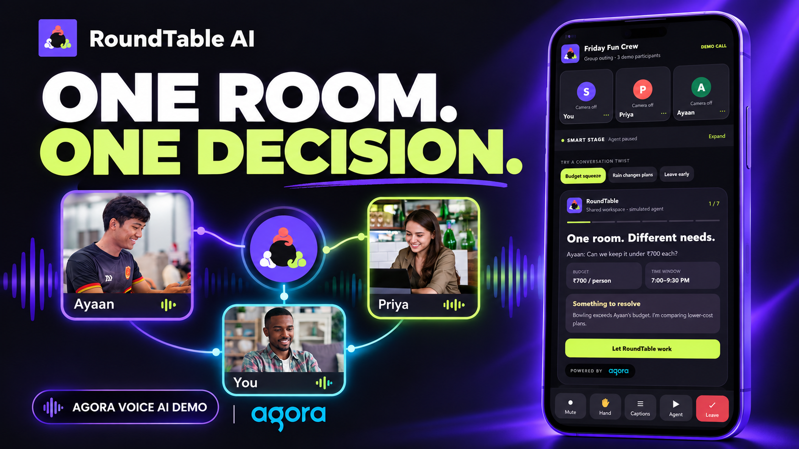](https://youtu.be/Ysq3IAfMn4Q)

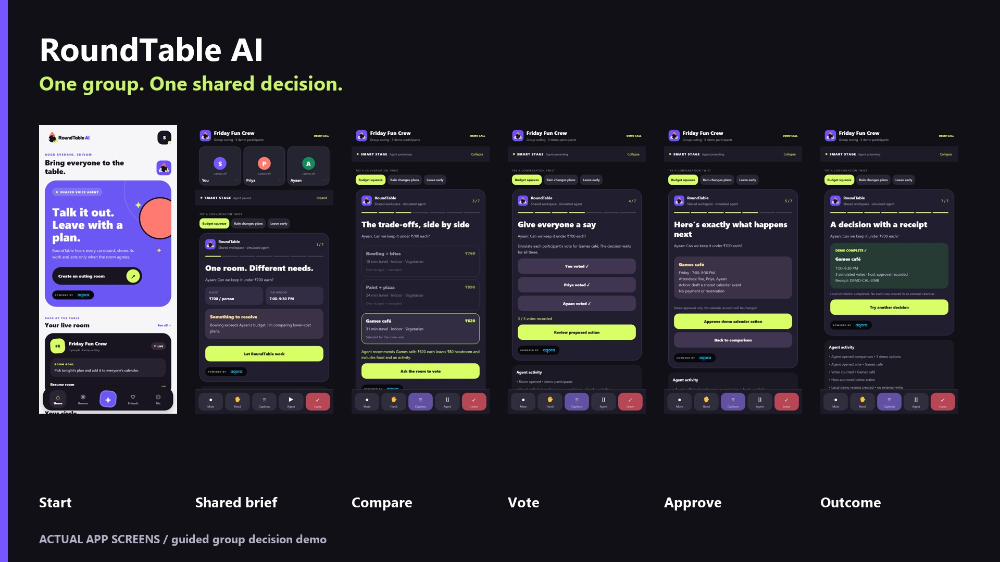

## Watch the room reach a decision

1. **Create a room.** Choose an outing, invite the crew and set a decision rule.
2. **Collect the brief.** Ayaan needs to stay under ₹700; Priya wants vegetarian food. The constraints stay visible beside the conversation.
3. **Compare fairly.** Bowling at ₹760 and painting at ₹890 are excluded. The ₹620 games café leaves ₹80 of headroom.
4. **Hear every vote.** Record each of the three demo participants' votes. The workflow waits for everyone.
5. **Review before acting.** The host sees the proposed plan, time and attendees and gives explicit approval.
6. **Show the outcome.** The local demo receipt records the selected plan, votes and approval.

Rain and early-departure scenarios change the brief and alternatives. Captions, stage expansion, microphone/hand-raise controls and agent pause make the shared experience easy to follow.

## Product walkthrough in screenshots

The screenshots below come from actual app interactions. Venue data, group participants, voting and the calendar receipt use the guided demo. The narrated video also includes a clearly labelled fictional conversation with licensed stock portraits and scripted voices.

### Start a room and make the brief visible

| Home | Create an outing |
|---|---|
| 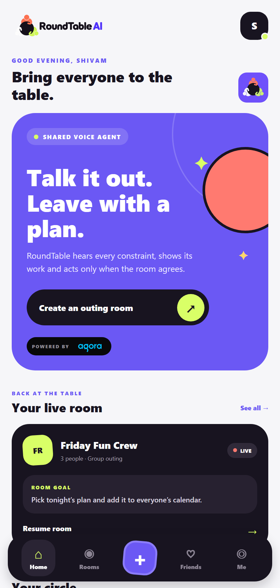 | 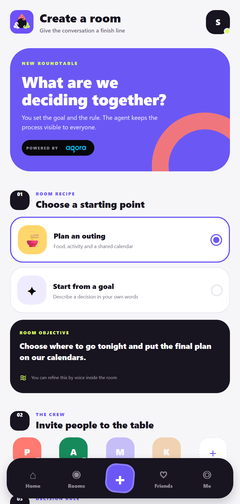 |

| Shared brief | Captions and conversation controls |
|---|---|
| 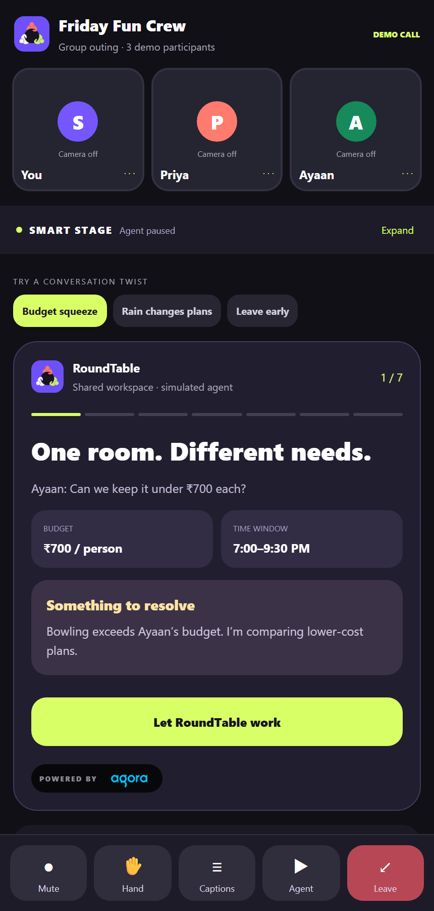 | 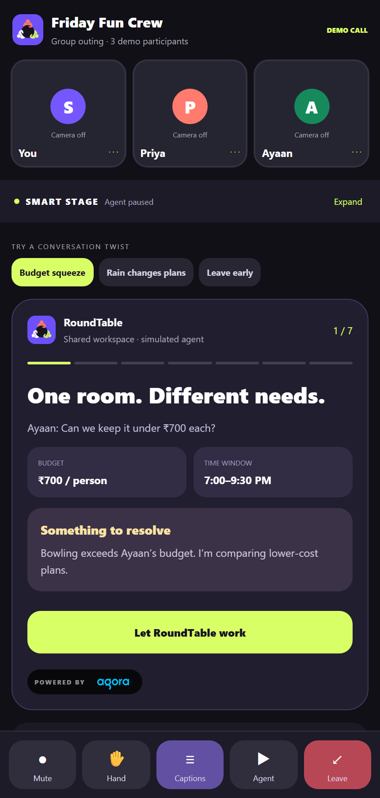 |

### Watch the agent's work and compare the trade-offs

| Expanded Smart Stage | Search stage |
|---|---|
| 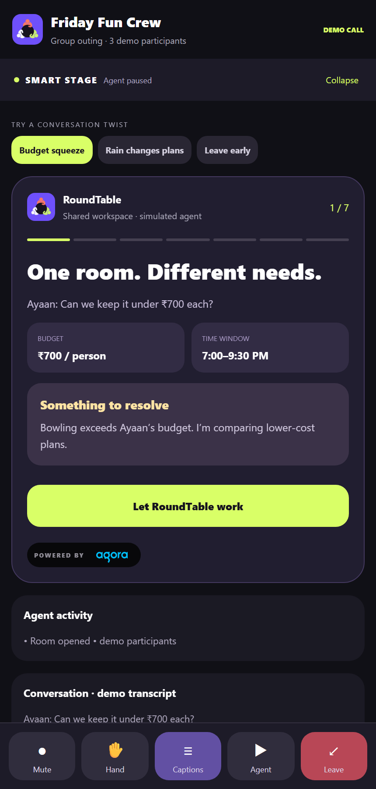 | 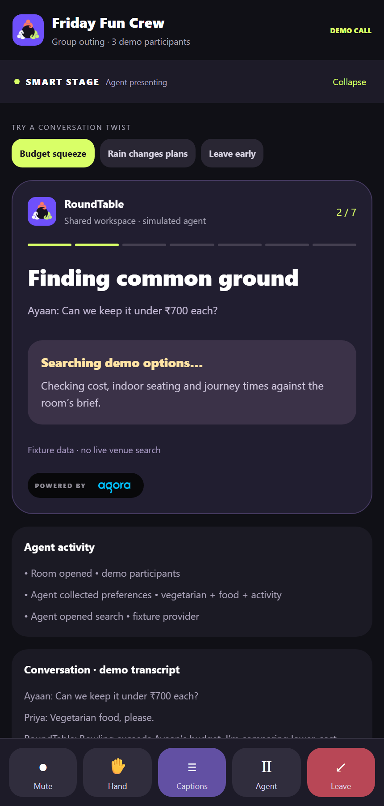 |

| Budget-aware comparison | All three votes recorded |
|---|---|
| 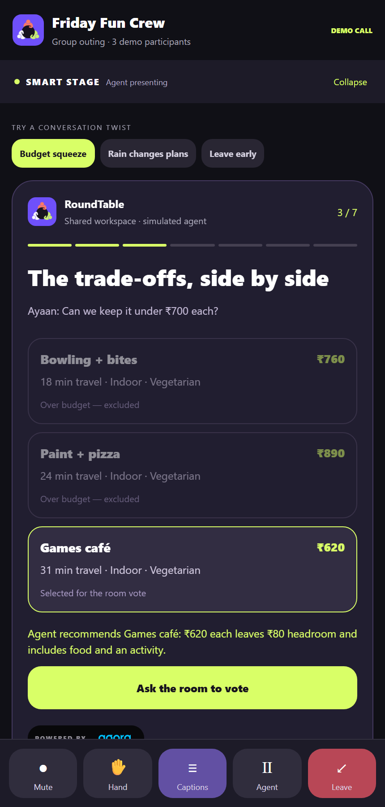 | 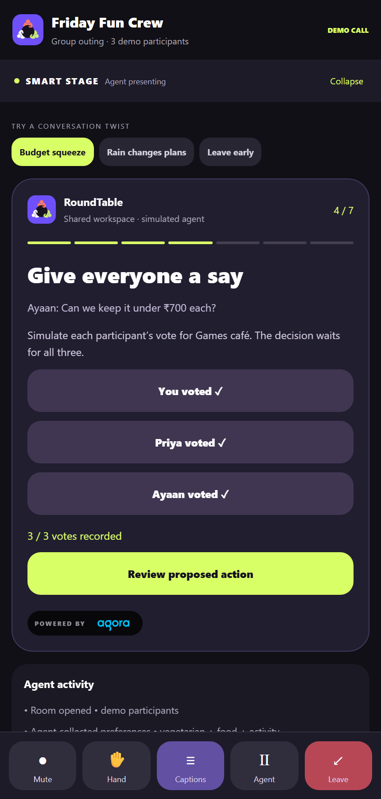 |

### Approve, receive an outcome and adapt

| Host action review | Local receipt |
|---|---|
| 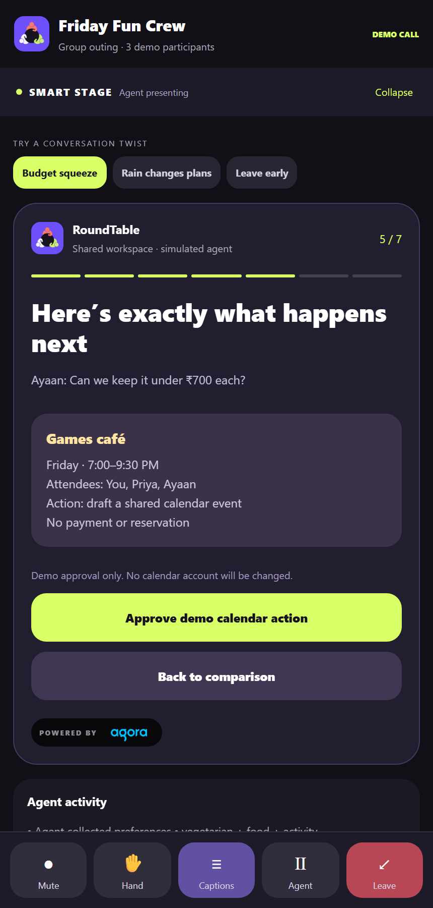 | 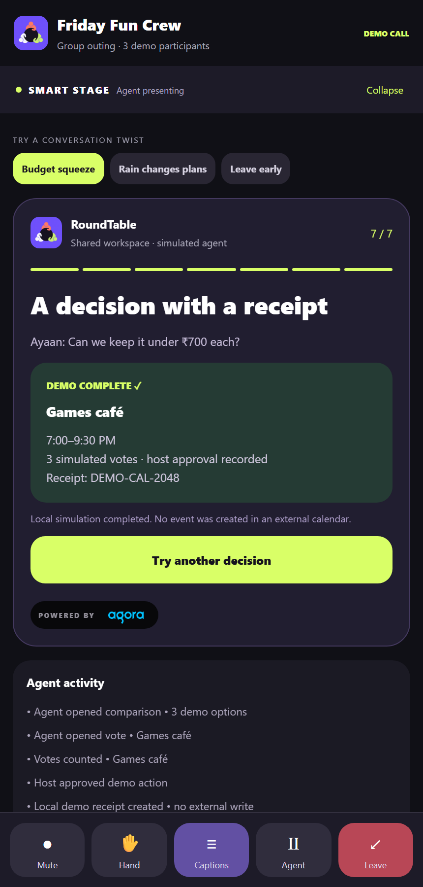 |

| Rain changes plans | Someone leaves early |
|---|---|
| 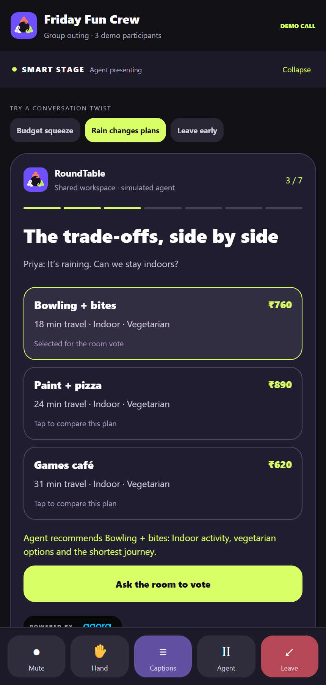 | 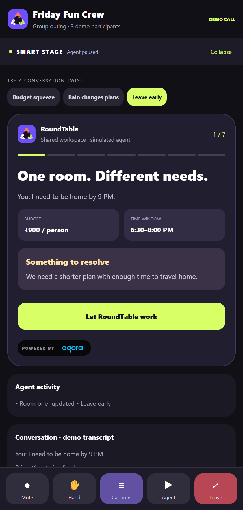 |

## The group conversation in the demo

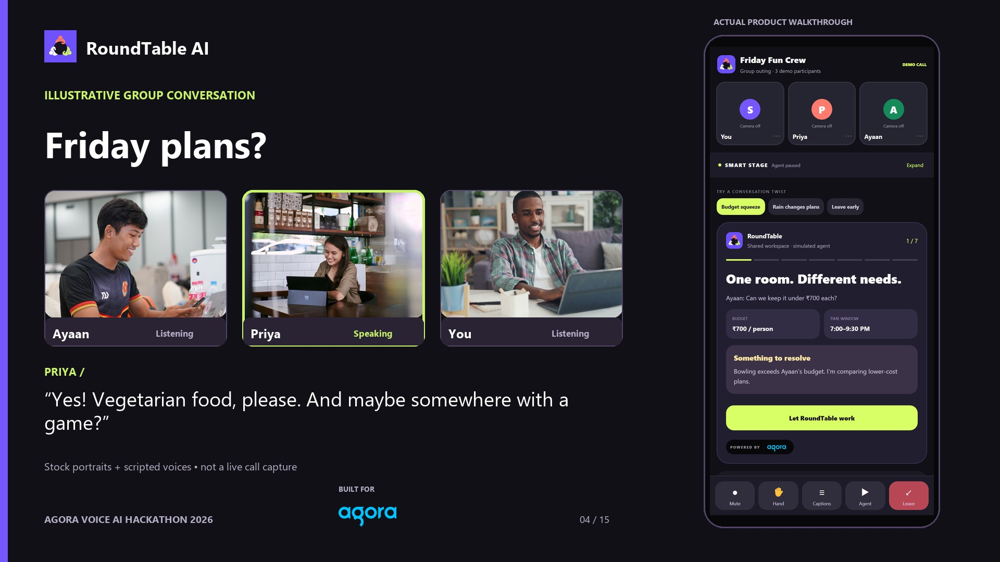

Licensed stock portraits and distinct scripted voices show how the group experience feels. This scene is labelled as an illustration; it is not a recorded live video call.

## Agora at the core

- **Agora RTC:** the native client publishes the microphone and receives the agent's audio.
- **Agora RTM:** transcripts and agent state flow into the client toolkit.
- **Agora Agent Client Toolkit:** coordinates the conversation lifecycle and client state.
- **Agora Conversational AI:** coordinates Deepgram speech recognition → OpenAI reasoning → MiniMax speech synthesis.
- **FastAPI:** generates short-lived tokens, starts/stops agents and keeps credentials on the server.
- **Voice controls:** voice activity detection, interruption configuration, metrics and errors are enabled in source.

On **30 September 2026**, the live account check successfully generated an Agora token, started a Conversational AI agent and stopped it. Android microphone playback and live transcript reception still need a device test. The shared guided stage is a separate deterministic workflow.

[Sanitized live backend check](docs/verification/agora-backend.json) · [Claim evidence](docs/claim-evidence.md)

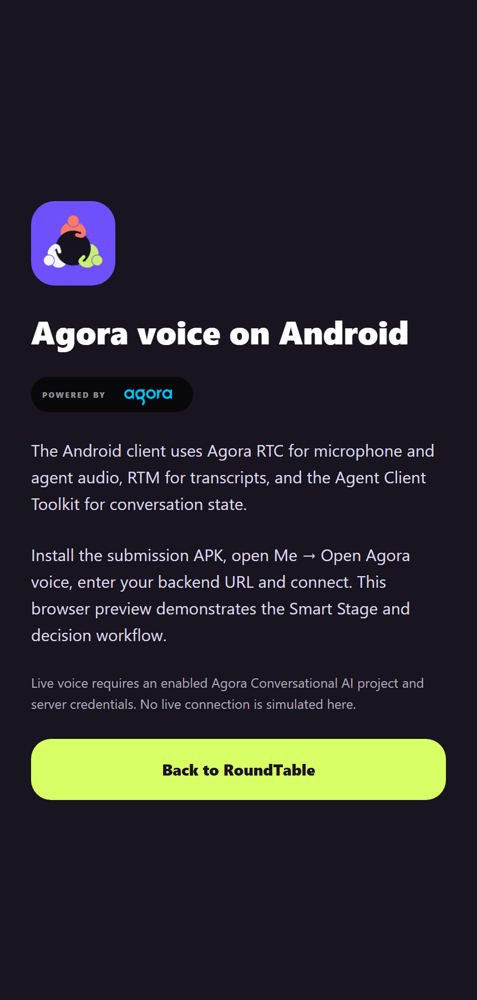

## Architecture

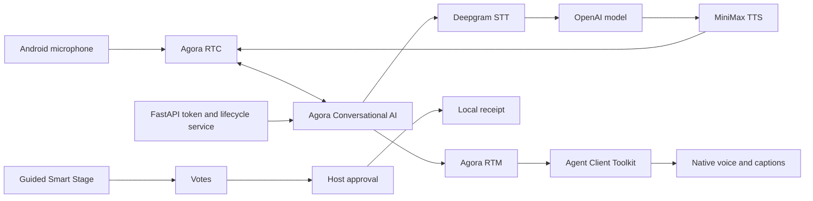

## Run it

Browser preview:

```bash
cd mobile
npm ci
npm run web
```

Open `http://127.0.0.1:5173` and follow **Create → Create room & invite → Let RoundTable work → votes → review → approve → receipt**.

For native voice, configure `server/.env` from `.env.example` with an enabled Agora Conversational AI project's App ID and certificate, install server dependencies and run `python src/server.py`. Install the ARM64 Android APK, then open **Me → Open Agora voice → backend URL → Prepare voice session → Connect Agora voice**. A physical phone needs a reachable LAN or HTTPS backend.

[Mobile setup](mobile/README.md) · [Server setup](server/README.md) · [Smart Stage guide](docs/smart-stage.md)

## Validation and current scope

- TypeScript, **17 Jest tests** and the production web build pass.
- **2 backend tests** pass; the live Agora token and agent lifecycle check passes.
- The standalone ARM64 Android workflow succeeded; the APK includes the reachable native voice entry and Agora libraries.
- The evaluator journey and recorded product interactions were verified in a logged-out browser.
- Group state synchronization, live venue providers, participant video capture and external calendar writes are next integrations. The demo receipt is local.

## Original work and attribution

Original work includes the social mobile experience, Smart Stage, budget/rain/time scenarios, voting and approval flow, branding, facilitation prompt and reachable native voice entry. Agora's official React Native Conversational AI recipe supplies the reused SDK foundation; see [its retained license](docs/AGORA_RECIPE_LICENSE).

[Media credits](docs/media-credits.md) explain the illustrative portrait scene. Server credentials, dependency folders and generated private artifacts are excluded from this public snapshot. The starter Android debug signing key is included only for reproducible test builds.

Built by **Shivam Mahendru** for the **Agora Voice AI Hackathon 2026**.
