# Agora Decision Rooms

> Talk together. Decide together.

One room for the whole group's next plan. **Kabir**, your AI facilitator, helps friends turn different budgets, food preferences and time constraints into a decision everyone can see and support. The **Smart Stage** shows the brief, real planning checks, venue options, each person's vote and the confirmed plan alongside the conversation.

**[Watch the demo](https://youtu.be/WUYoZa39Y3s)** · **[Explore the browser preview](https://shhhivam12.github.io/roundtable-ai-hackathon/evaluator/)** · **[Download the current Android test APK](https://github.com/shhhivam12/roundtable-ai-hackathon/releases/latest)** · **[The 10-image product story](docs/assets/decision-rooms-screenshots-v2/README.md)** · **[Commudle submission](https://www.commudle.com/builds/roundtable-ai-shared-voice-decisions-with-agora)**

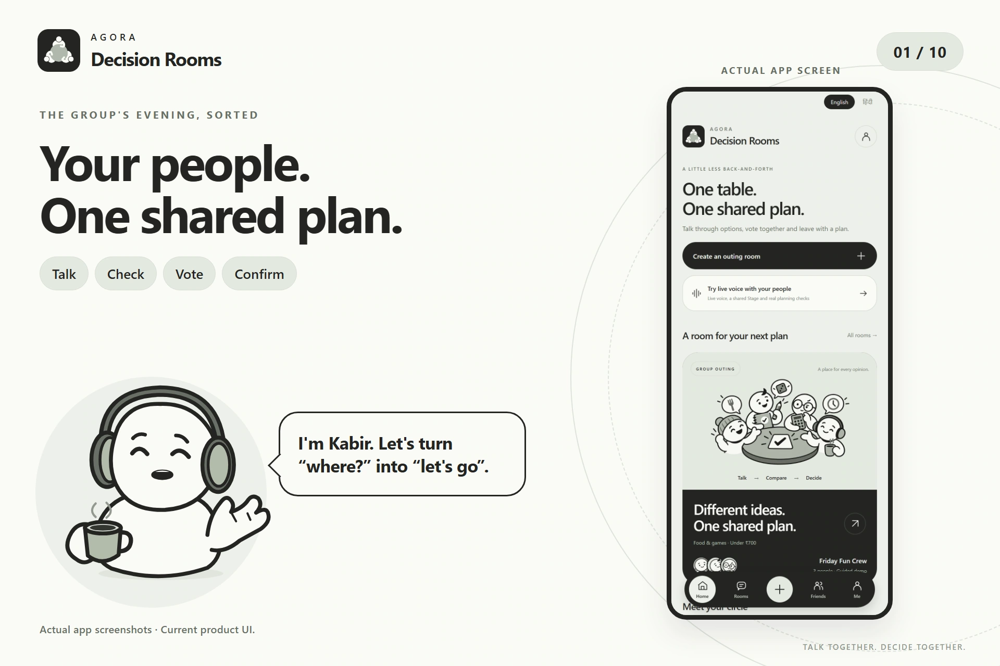

## From “where should we go?” to one shared plan

1. **Bring your people.** Start a room, share its code and invite up to four members.
2. **Hear the whole group.** Talk in English, Hindi or Hinglish. Keep everyone's budget, food and indoor preferences visible on the Stage; edit them when needed.
3. **Let Kabir do the checks.** Discover real venues, look up listed reservation policies and opening hours, check the weather, and estimate the drive.
4. **Compare with context.** Every result carries its source and check time. Missing prices, seating information or reservation details stay unknown.
5. **Everyone gets a vote.** Each member chooses **Support** or **Needs changes** from their own device. Changes to the plan or group reset agreement.
6. **Confirm together.** The host can confirm only after every current member supports the same plan. The shared outcome records the plan, votes and approval.

### A story told through the real UI

| Start and join | Share preferences |
| --- | --- |
| 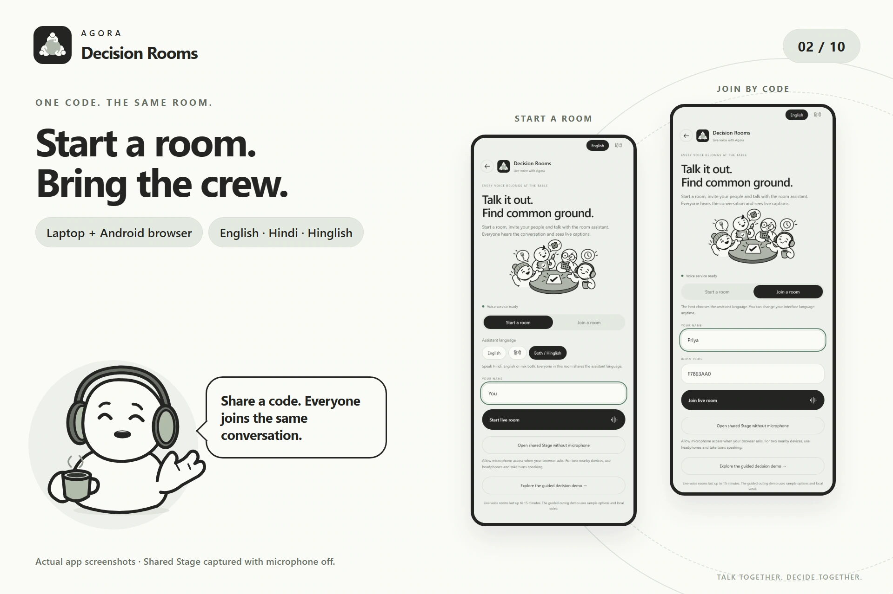 | 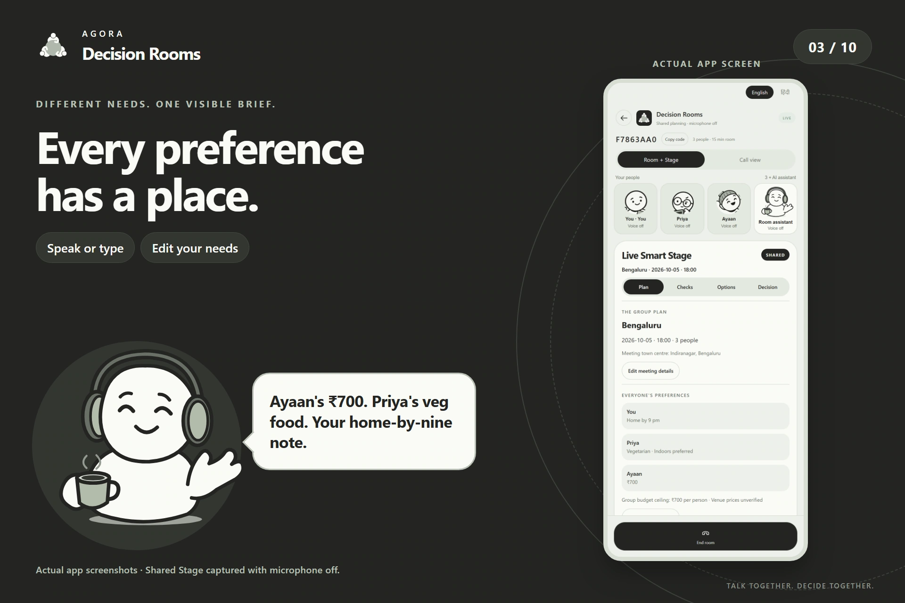 |

| Watch the Smart Stage work | Compare real venue options |
| --- | --- |
| 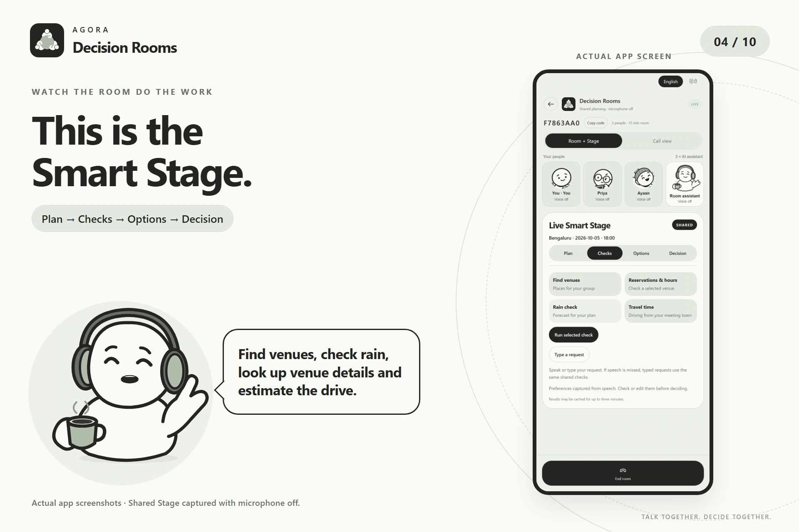 | 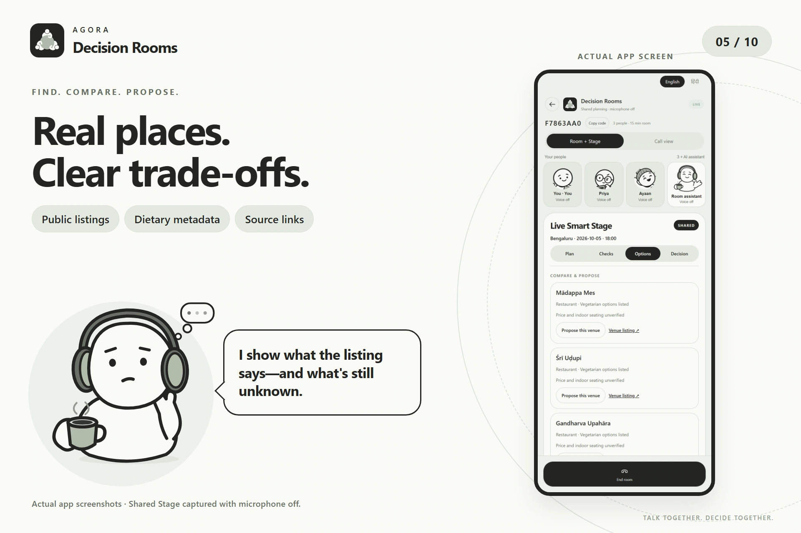 |

| Check the details | Adapt the brief |
| --- | --- |
| 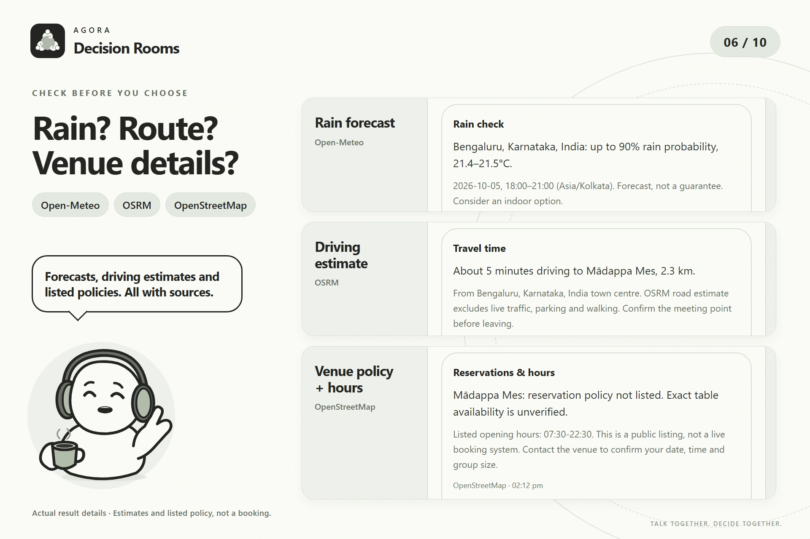 |  |

| Hear every vote | Leave with a confirmed plan |
| --- | --- |
| 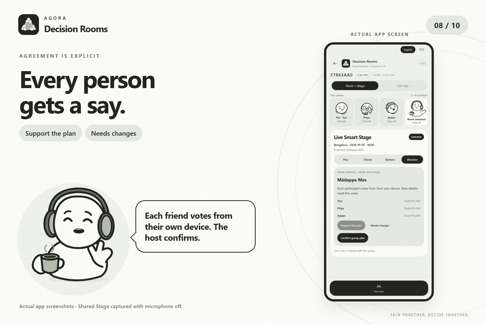 | 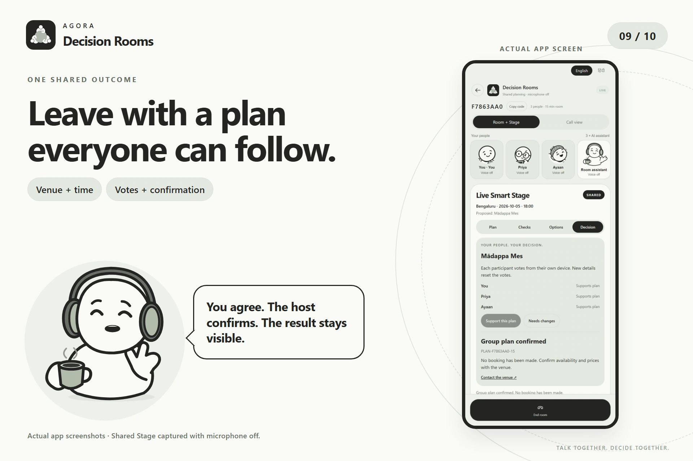 |

These cards contain unchanged screenshots captured from the current app. The room, public provider results and three authenticated members' votes were exercised against the backend through the microphone-free Stage entry. The cast illustrates the group; this capture did not record an Agora call. Provider values are dated examples.

## Smart Stage: the agent's work stays visible

| Capability | What the room sees |
| --- | --- |
| **Speech to a shared brief** | Finalized member turns can update bilingual budget, diet and indoor preferences with speaker attribution. Typed editing remains available. |
| **Venue discovery** | Up to four real cafes/restaurants from OpenStreetMap/Overpass with source links and listed vegetarian metadata. |
| **Reservation policy and hours** | Listed policy, opening hours and public contacts; exact table availability and booking slots are not supplied. |
| **Weather check** | Open-Meteo rain probability and temperature for the selected three-hour window within the next seven days. |
| **Travel check** | OSRM driving time and distance from a named town centre; live traffic, parking and walking time are excluded. |
| **Context and recovery** | Missing-detail follow-ups, bounded retries, visible errors and clearly dated cached results. Failed real checks never become sample results. |
| **Grounded explanation** | Completed results, source and time can be sent into the active Agora session for Kabir to discuss. |
| **Consent that belongs to people** | Member-authenticated votes, unanimous support, host approval and protection against confirming a stale plan. |

**Plan / Checks / Options / Decision** keeps each step accessible. Switch between the Stage, people and captions without restarting the call. The microphone-free entry supports real backend planning and voting when someone prefers to type.

The app confirms a plan. It does not make a reservation, charge money or write a calendar event.

## Agora carries the conversation

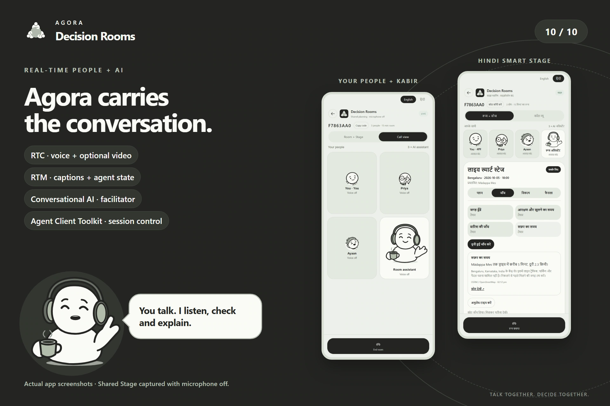

- **Agora RTC:** shared microphone audio, assistant audio and optional participant video in the browser room.
- **Agora RTM:** live captions, assistant state and errors.
- **Agora Agent Client Toolkit:** conversation lifecycle and client state.
- **Agora Conversational AI:** Deepgram speech recognition → OpenAI reasoning → MiniMax speech synthesis, with VAD and interruption configured.
- **FastAPI:** scoped tokens, one assistant per room, shared Stage state and room cleanup. Credentials stay server-side.
- **Kabir:** a native SVG/CSS assistant in the browser, with listening/thinking/speaking gestures and an audio-reactive mouth. The recurring cast is a visual identity; the room has one AI facilitator.

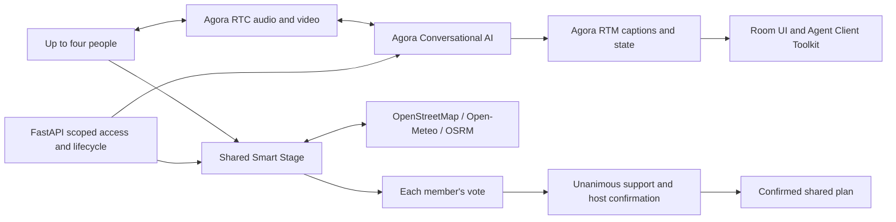

## Try it and run it

The GitHub Pages link is a **static preview of the current UI and guided sample**. Shared rooms, live voice and public checks require the backend. The guided outing is a separate offline example with sample venues and simulated votes.

```bash
cd mobile
npm ci
npm run web
```

In a second terminal, configure `server/.env` from [the example](server/.env.example), install the Python requirements and start the backend:

```bash
cd server
python -m venv .venv
# Activate the environment, then:
pip install -r requirements.txt -r requirements-dev.txt
python src/server.py
```

Open `http://localhost:5173` → **Try live voice with your people**. Create/join a room or choose **Open shared Stage without microphone**. Live voice requires an enabled Agora project and server-side credentials.

**Android:** the current ARM64 standalone test APK includes the refreshed branding, Kabir artwork, guided outing and native Agora voice entry. It runs without Metro. For native voice, enter a reachable backend URL; `10.0.2.2` is the emulator alias. The shared browser Stage and participant video run in Android Chrome using the [laptop + phone guide](docs/live-demo-guide.md).

[Mobile and APK setup](mobile/README.md) · [Backend setup](server/README.md) · [Live Stage guide](docs/live-smart-stage.md) · [HTTPS hosting](docs/live-demo-guide.md)

## Evidence and scope

TypeScript, frontend tests, backend tests and the production web build are checked before publication. [Claim evidence](docs/claim-evidence.md) separates source implementation, real-provider checks, user-reported voice results and physical-device checks. Four public reads, shared member views, actual votes and confirmation gates have recorded backend evidence. Physical Hindi audibility, speech-to-card capture and two-device video still need their own phone rehearsal.

Rooms are ephemeral: up to four members, approximately 15 minutes, one backend worker. Restarting the backend clears active rooms. The Android APK uses test signing and is intended for phone testing, not Play Store distribution.

## Demo video

**[Watch the latest creator-recorded demo](https://youtu.be/WUYoZa39Y3s)**

[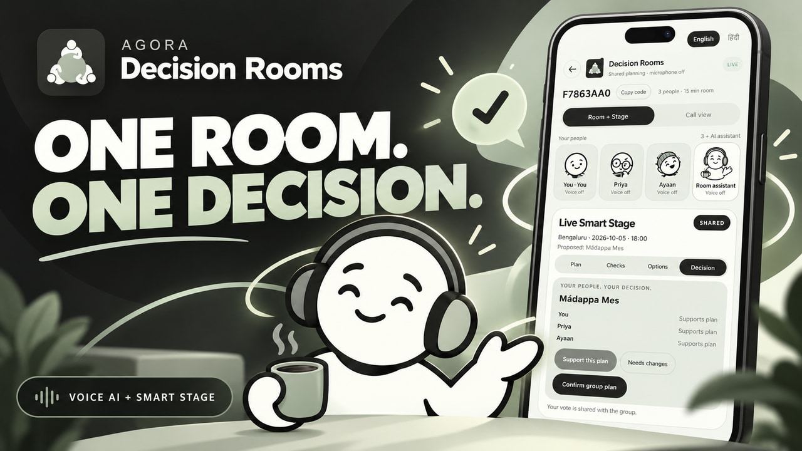](https://youtu.be/WUYoZa39Y3s)

The six-minute walkthrough shows the current UI, room setup, a single-participant live Agora session, captions and a weather request. The shared provider/voting evidence is documented separately in [claim evidence](docs/claim-evidence.md).

## Original work

Built by **Shivam Mahendru** for the **Agora Voice AI Hackathon 2026**. Original work includes the product UI, Kabir and recurring cast, shared room lifecycle, Smart Stage, public planning checks, bilingual experience, voting and consent flow. Agora's official React Native Conversational AI recipe supplies the reused native SDK foundation; see [its retained license](docs/AGORA_RECIPE_LICENSE). This is an independent project built with Agora.
