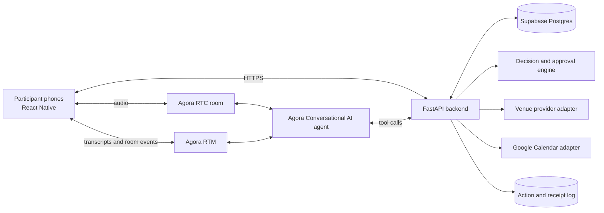

# Architecture

## Recommended shape



## Mobile client

Use bare React Native with TypeScript, based on Agora's official React Native recipe rather than starting from an empty application.

Responsibilities:

- join and leave the Agora RTC room;
- publish microphone audio and subscribe to participants and agent audio;
- receive transcript and agent-state events over RTM;
- render presence, speaking state, transcript, constraints, options, votes, approvals, and receipts;
- send explicit user interactions to the backend;
- recover cleanly from microphone denial, reconnects, or autoplay/audio issues.

Why bare React Native:

- one UI codebase for Android and iOS;
- TypeScript fits the user's current experience better than a new native language;
- the official Agora recipe demonstrates the required native RTC and RTM adapters;
- direct native-module access is more predictable than relying on Expo Go.

Expo Go is not the target because the Agora native modules require a custom native build. Expo development builds could be considered later, but they do not reduce the core native integration risk enough to justify changing the official starter path.

## Agora layer

Use:

- `react-native-agora` for RTC;
- `agora-react-native-rtm` for signaling and transcript events;
- `agora-agent-client-toolkit` for agent transcript and state handling;
- Agora Conversational AI for the real-time speech pipeline;
- a unique UID for every participant and the agent.

The server SDK accepts a list of remote UIDs for an agent session. The room service should maintain the active participant UID list and make participant attribution explicit in application state.

## Backend

Use Python with FastAPI so the application can extend the official recipe while keeping orchestration and domain logic readable.

Responsibilities:

- mint short-lived RTC and RTM tokens;
- start, update, and stop the Agora agent;
- validate room membership and permissions;
- store normalized constraints and options;
- run the deterministic decision and approval rules;
- execute integration adapters with idempotency keys;
- persist immutable audit events and provider receipts;
- expose deterministic demo fixtures when a live provider is unavailable.

## Core domain model

```text
Room
  id, title, goal, status, decision_rule, owner_id

Participant
  id, room_id, display_name, agora_uid, role, presence

Constraint
  id, room_id, participant_id, type, value, visibility, confidence, status

Option
  id, room_id, provider, provider_ref, comparison_fields, availability_status

Vote
  id, room_id, participant_id, option_id, rank, decision_version

Approval
  id, room_id, participant_id, action_id, decision, decided_at

Action
  id, room_id, type, payload, policy, idempotency_key, status

Receipt
  id, action_id, provider, provider_ref, status, safe_display_payload
```

## Decision and authorization boundary

The LLM must not directly declare a winner or invoke a side effect.

1. The agent proposes structured constraint or option candidates.
2. The backend validates them against typed schemas.
3. Participants can correct attributed constraints.
4. The backend freezes a decision version before voting.
5. Deterministic code evaluates the configured rule.
6. The backend creates a pending action and calculates required approvers.
7. Only a satisfied approval policy can enqueue execution.
8. The integration adapter performs an idempotent request.
9. A receipt records success, failure, or uncertain completion.

## Demo reliability strategy

Every external provider uses one interface with two implementations:

- `live`: real provider API with credentials;
- `fixture`: deterministic local data with a visible `Demo data` label.

The calendar execution should be live for the final demo. Venue search can fall back to fixtures if the provider is unavailable. The UI must never imply that fixture output came from a live provider.

## Security baseline

- never ship Agora certificates, provider secrets, or OAuth refresh tokens in the app;
- mint short-lived channel tokens on the backend;
- validate room membership on every mutation;
- minimize transcript retention;
- separate public constraint text from private constraint values;
- require explicit confirmation for external writes;
- redact secrets and personal data from receipts and logs.

