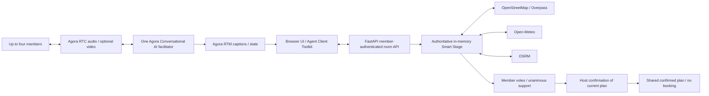

# Agora Decision Rooms architecture

The current product has a shared browser room and a separate native voice/guided outing flow. Both use React Native/TypeScript UI foundations; React Native Web and Vite serve the browser experience. FastAPI owns scoped access, Agora lifecycle and the live Smart Stage.

## Shared browser room

`voice_rooms.py` creates/join rooms, allocates distinct numeric UIDs, scopes member access and manages one idempotent assistant. RTC/RTM tokens are short-lived. Rooms allow four members, expire after roughly 15 minutes and live in memory; run one worker. Leaving and expiry clean up the session.

`WebVoiceSession.ts` handles RTC audio/video, RTM captions and toolkit state. The assistant uses Deepgram STT, Agora-managed OpenAI and MiniMax TTS. Participant video is not sent as AI vision input. Kabir's browser avatar uses SVG/CSS gestures and received audio volume.

`live_stage.py` owns preferences, meeting context, provider checks, proposals, member votes and confirmation. Finalized member speech can update bilingual preferences. Partial captions and agent speech cannot create user votes or approve a plan.

`planning_tools.py` supplies four public read checks: venue discovery, listed reservation policy/hours, weather and driving estimates. Results include source/time, uncertainty, bounded retries and disclosed cached results. Missing context leaves a pending request. Failed real checks never silently substitute fixtures. Completed results can be sent to the active Agora session through `AgentSession.think`.

Every mutation requires scoped membership. Each member casts their own vote. Changed context, venue or roster resets consensus. The host can confirm only unanimous support of the current revision. No booking, payment, calendar adapter or persistent database is implemented.

## Separate native and guided paths

The Android APK packages the current branded UI, guided local outing and native RTC/RTM voice adapters. Native voice retains `/get_config`, `/startAgent` and `/stopAgent`; a physical phone needs a reachable backend. Shared browser Stage and group video currently run in Android Chrome.

The offline guided outing uses labelled fixture venues, simulated votes and a local receipt. It is separate from real shared room state and cannot perform external writes.

## Hosting and security

The server can serve the production client and API from one HTTPS origin; `Dockerfile` prepares that deployment and disables the legacy native endpoints by default. GitHub Pages is a static UI/guided preview and cannot run FastAPI or Agora lifecycle.

Agora certificates and vendor keys stay in server environment variables. Public snapshots omit member secrets/tokens. Camera capture is opt-in; leaving closes media tracks. No deployment, production readiness or physical-device results are implied by architecture alone.

[Live Stage](live-smart-stage.md) · [Device guide](live-demo-guide.md) · [Claim evidence](claim-evidence.md)
